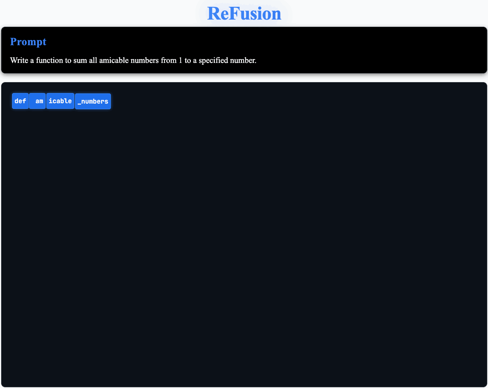
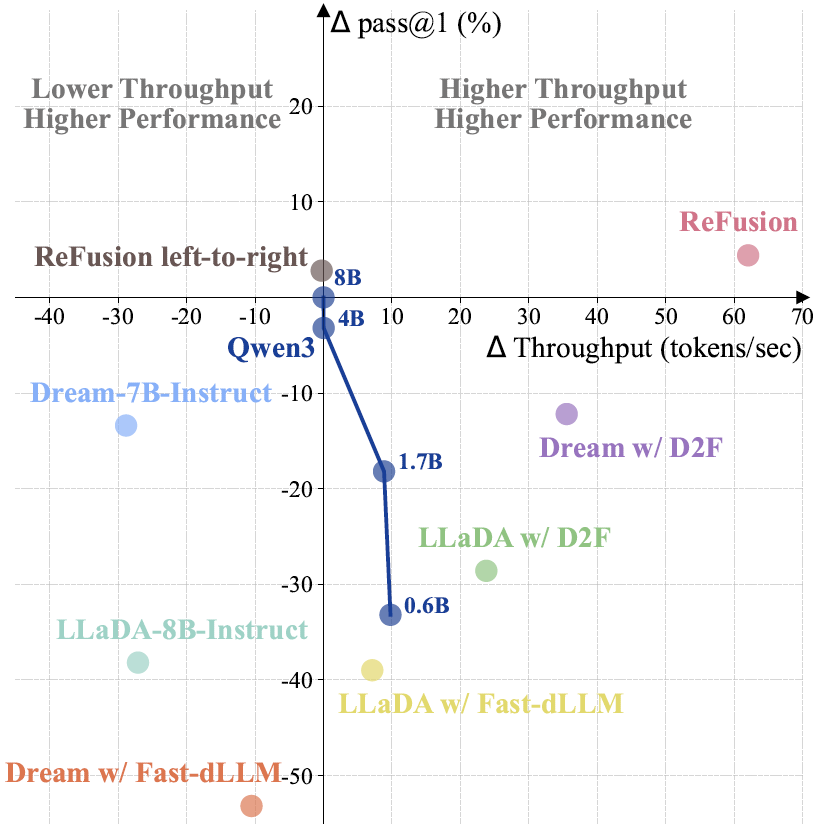
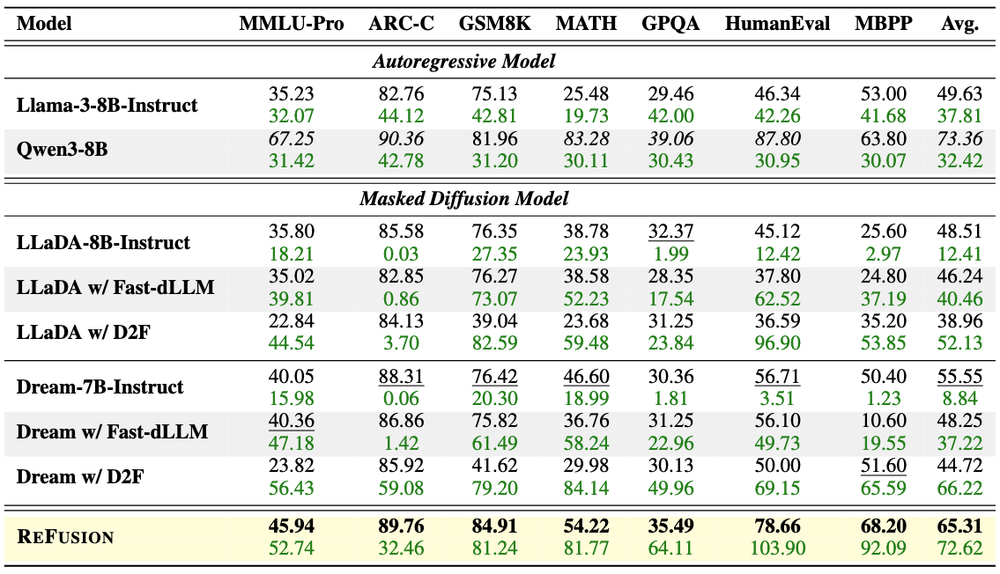

<div align="center">

# ReFusion: A Diffusion Large Language Model with Parallel Autoregressive Decoding

[](http://arxiv.org/abs/2512.13586)
[](https://huggingface.co/GSAI-ML/ReFusion)
[](https://huggingface.co/datasets/GSAI-ML/ReFusion)

<br>



</div>

## Introduction
We introduce ReFusion, a novel masked diffusion model featuring two core innovations:
1. It unifies a causal attention mechanism with global, any-order slot generation, **enabling full KV cache reuse without sacrificing flexibility**.
2. It simplifies the learning objective from an intractable token-combination space to a manageable slot-permutation space, **significantly boosting learning efficiency**.

Empirically, ReFusion not only outperforms prior MDMs with a **34% performance gain** and an over **18× speedup** on average, but also bridges the performance gap to strong ARMs while maintaining a **2.33× average speedup**.

<div align="center">
  

  <br>

  <em>Figure: ReFusion achieves the best balance of speed and accuracy on MBPP. Metrics are calculated relative to the Qwen3-8B baseline.</em>
</div>

## Usage
### Environment Setup
```bash
git clone https://github.com/ML-GSAI/ReFusion.git
cd ReFusion
conda env create -f refusion_full_env.yml
conda activate refusion_py10
```

### Training
#### 1. Data Preparation
We provide a sample dataset in `data/train_data.json` to illustrate the required format. Please ensure your training data is organized as a JSON list of objects, where each object contains a `query` and a `response`.

**Data Format Example:**

```json
[
    {
        "query": "...",
        "response": "..."
    },
    {
        "query": "...",
        "response": "..."
    }
]
```

#### 2. Running the Training Script

**Single-Node Training:**

To train on a single machine, simply run:

```bash
bash train.sh
```

**Multi-Node Training:**

For distributed training across multiple nodes (e.g., 2 nodes), specify the node count (`-n`), current rank (`-r`), and the master node IP address (`-m`):

```bash
# Example: Running on the master node (Rank 0)
bash train.sh -n 2 -r 0 -m 192.168.1.1

# Example: Running on the worker node (Rank 1)
bash train.sh -n 2 -r 1 -m 192.168.1.1
```

### Inference
```python
python generate.py
```

### Evaluation
```bash
bash eval.sh
```

## Experimental Results
<div align="center">
  
  <br>
  <em>Table: Zero-shot performance and throughput (TPS) comparison on multiple benchmarks. Each model displays accuracy/pass@1 (top row) and throughput (TPS, bottom row).</em>
</div>

**Key Results:**

* **Superior Performance:** ReFusion achieves a **34% performance gain** over prior MDMs.
* **High Efficiency:** It provides an over **18× speedup** compared to MDMs and a **2.33× speedup** compared to strong ARMs.
* **Gap Bridging:** ReFusion effectively bridges the performance gap to strong ARMs while maintaining significantly faster inference speeds.

## Citation

If you find our work helpful, please consider citing our paper.

```bibtex
@misc{li2025refusiondiffusionlargelanguage,
      title={ReFusion: A Diffusion Large Language Model with Parallel Autoregressive Decoding}, 
      author={Jia-Nan Li and Jian Guan and Wei Wu and Chongxuan Li},
      year={2025},
      eprint={2512.13586},
      archivePrefix={arXiv},
      primaryClass={cs.CL},
      url={https://arxiv.org/abs/2512.13586}, 
}
```
